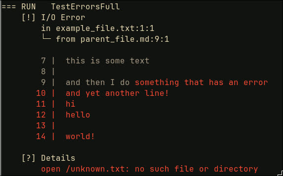

# Tomefile Errors Library

Detailed, pretty-printed errors for tomefile.



## Example usage

```go
_, err := os.ReadFile("example.txt")
derr := &liberrors.DetailedError{
    Name:    liberrors.ERROR_IO,
    Details: err.Error(),
    Trace: []liberrors.TraceItem{
        {
            Name: "example_file.txt",
            Col:  1,
            Row:  1,
        },
        {
            Name: "parent_file.md",
            Col:  1,
            Row:  9,
        },
    },
    Context: liberrors.Context{
        FirstLine:   7,
        Buffer:      "this is some text\nthis line has ",
        Highlighted: "an error",
    },
}
derr.Print(os.Stderr)
```

Will produce:
```
[!] I/O Error
    in example_file.txt:1:1
    └─ from parent_file.md:9:1

    7 |  this is some text
    8 |  this line has an error

[?] Details
    open example.txt: no such file or directory
```
